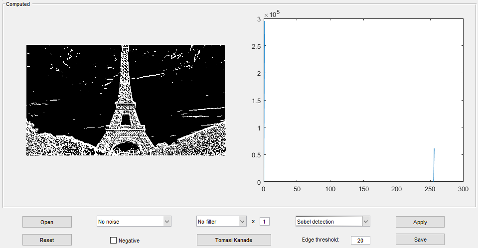
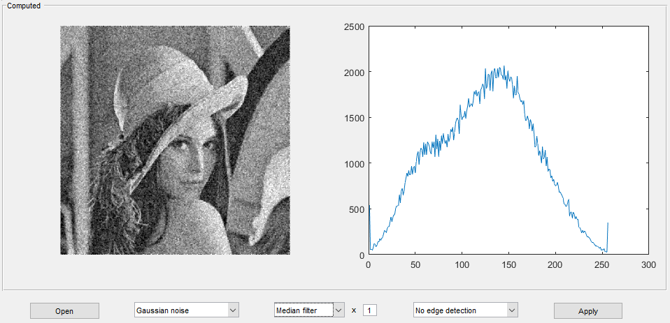
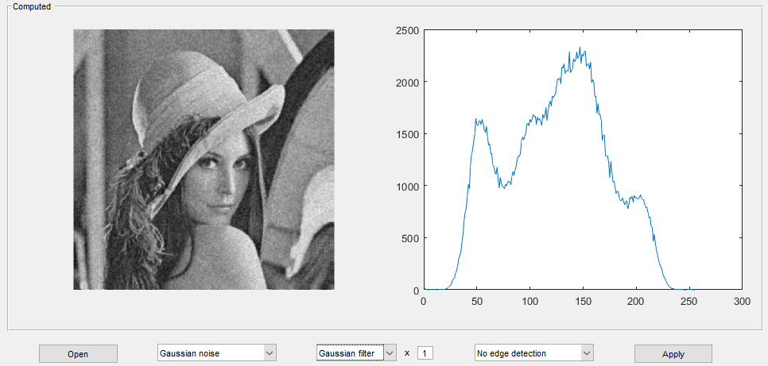
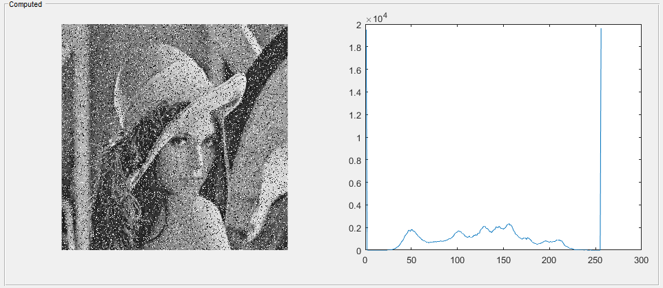
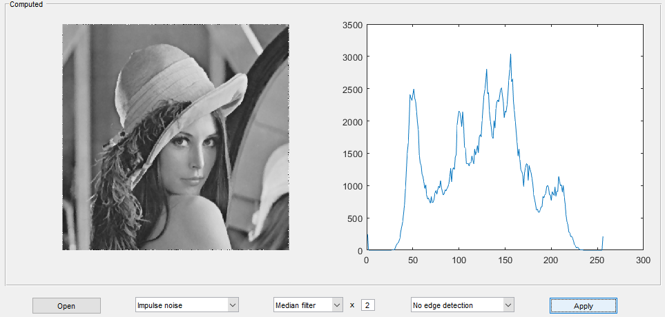

# ComputerVision-Algorithms
Software for simple use of low-level Computer Vision Algorithms.

Through a clear GUI it's possible to:
* upload an image, which will be automatically converted to the grayscale;
* compute the image histogram;
* apply the Negative filter;
* apply noises (Gaussian, Impulse noises);
* apply digital filters for noise reduction (Average, Median, Gaussian filters);
* make edges detection (Roberts Cross, Sobel algorithms);
* make features detection (Tomasi Kanade algorithm);
* save the new image, obviously!

Developed with @latios93.

See some screenshots!

## Edge detection

## Gaussian Noise
### Application

### Reduction

## Impulse Noise
### Application

### Reduction
